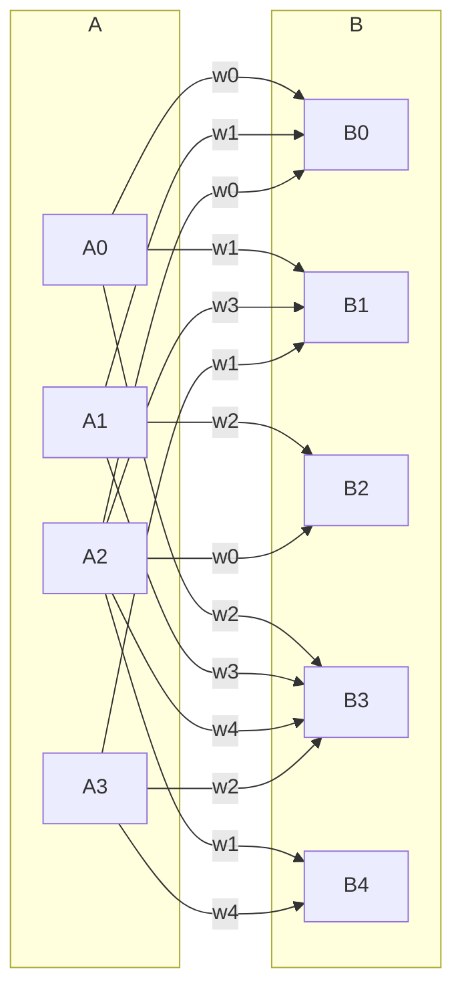

# AGI Green Vue client

The client is designed to have minimal business logic, and to be driven by an app running on the python server via websockets, instead of a client app requesting data via REST API.

The client provides a few general purpose components for use by the python app.

## Chat.vue

A general purpose chat UI. For chatting with humans and agents.

Messages are handled by:

- `ws_set_user_data`: sets avatar and other user data
- `ws_append_chat`: adds a message

User chat input is sent to the server app via `send_ws('chat_input', 'cpontent')`, and echoed by the server.

## Markdown.vue

Displays and interacts with md documents.

- mathjax
- mermaid
- forms (a custom md extension to provide interactive forms)

### Forms example:

<!-- Form { "title": "A list of tasks", "type": "object", "required": [ "title" ], "properties": { "title": { "type": "string", "title": "Task list title" }, "tasks": { "type": "array", "title": "Tasks", "items": { "type": "object", "required": [ "title" ], "properties": { "title": { "type": "string", "title": "Title", "description": "A sample title" }, "details": { "type": "string", "title": "Task details", "description": "Enter the task details" }, "done": { "type": "boolean", "title": "Done?", "default": false }, "satisfied": { "type": "boolean", "title": "satisfied?", "default": false } } } } } } -->

### Mermaid example:

### MathML example:

$$ B_i = \phi(\sum_j A[p_{ij}]w[q_{ij}]) $$

## GameIO.vue

(to be ported from obsolete code from before vue conversion)

- play board games with user

